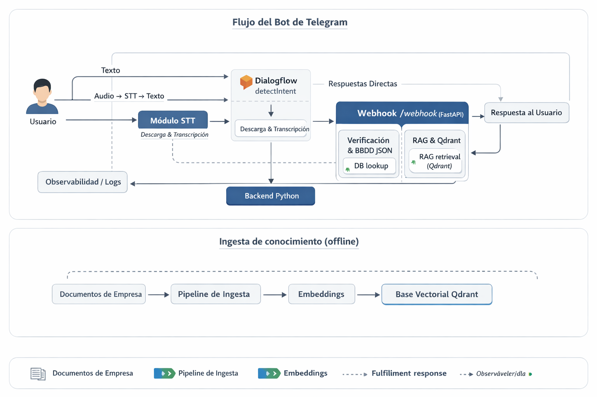

# Memoria del proyecto: Chatbot Deuda (Dialogflow + Telegram + RAG)

## 1. Resumen ejecutivo

Este proyecto implementa un prototipo de asistente conversacional para consultas de facturación eléctrica. El sistema se apoya en Dialogflow ES para interpretar intenciones y un webhook en FastAPI para responder en los casos en los que se necesite mayor información. El webhook permite redirigir (en función de la intención interpretada) a dos caminos diferentes: uno con datos deterministas (estado de cuenta, facturas y pagos) en el caso de preguntas concretas sobre sus suministros o contratos activos. En paralelo, se ha preparado un flujo RAG (Retrieval Augmented Generation) con Qdrant que permite responder preguntas informativas basadas en documentos generales de la empresa.

El objetivo final es un servicio conectado a Telegram: el usuario escribe o envía audio, Dialogflow interpreta la intención y decide si necesita fulfillment (llamada al webhook). Si no lo necesita, responde directamente con una respuesta aletaoria de una batería propuesta de respuestas; si lo necesita, el webhook realiza la lógica de negocio determinista o deriva a RAG cuando proceda.

## 2. Alcance y objetivos

### Objetivos funcionales

 - Consultas de estado de pago.
 - Listado de facturas pendientes y total adeudado.
 - Fecha estimada de próxima factura.
 - Envío de factura (simulado) por canal.
 - Envío de enlace de pago (simulado).
 - Respuestas informativas sobre pagos, condiciones y atención (vía RAG).

## 3. Arquitectura de alto nivel

Esquema general:

Flujo deseado del prototipo:

1. Usuario -> Telegram (texto o voz).
2. Bot Telegram -> Dialogflow (detect intent).
3. Dialogflow:
   - Sin fulfillment: responde directo al usuario.
   - Con fulfillment: llama a `POST /dialogflow/webhook`.
4. Webhook:
   - Si es determinista: resuelve con datos.
   - Si requiere conocimiento documental: consulta RAG y responde.

Componentes principales:

- Bot Telegram: `app/app.py`.
- Webhook Dialogflow (FastAPI): `app/main.py`.
- Motor RAG (LangChain + Qdrant): `app/src/agent/*`.
- Indexador de PDFs: `app/scripts/rag_indexer.py`.
- Almacen de datos demo: `app/data/sample_data.json`.

## 4. Estado actual del codigo

Implementado:

- Webhook de Dialogflow con intents deterministas y manejo de identidad.
- Bot de Telegram (texto y voz, con STT opcional).
- Pipeline RAG completo (ingesta + embeddings + Qdrant + cadena).

Pendiente o parcial:

- Exponer el endpoint RAG como servicio FastAPI.
- Conectar el RAG a intents informativas dentro del webhook de Dialogflow.
- Dockerfile de la API (el compose actual lo referencia pero no esta en el repo).

## 5. Detalle de componentes

### 5.1. Webhook Dialogflow

Archivo: `app/main.py`

- Endpoint `POST /dialogflow/webhook`.
- Identificacion del usuario por DNI parcial y CUPS.
- Contextos de Dialogflow para pedir identidad y reintentar acciones.
Intents actuales:

**Manejados por el webhook:**
  **- Respuesta determinista**
   - `Auth.ProvideIdentity`
   - `Billing.Info.AccountStatus`
   - `Billing.Info.OutstandingAmount`
   - `Billing.Info.UnpaidInvoices`
   - `Billing.SendInvoice.ByMonth`
   - `Billing.SendInvoice.Channel`
   - `Billing.SendInvoice.Last`
   - `Info.NextInvoiceDate`
   - `Payments.SendLink`
   
   **- Respuesta modelo de lenguaje**
   - `Info.General`

**Respuesta directa en Dialogflow:**
   - `Default.WelcomeIntent`
   - `Default.Fallback`
   - `Default.FeedBack.Possitive`
   - `Default.FeedBack.Negative`
   - `Payments.Options`
   - `Support.HumanHandoff`

### 5.2. Bot Telegram

Archivo: `app/app.py`

- Procesa texto y voz.
- envía mensajes a Dialogflow con `detect_intent`.
- Responde al usuario con `fulfillment_text`.
- Incluye STT con Whisper y TTS opcional.

### 5.3. RAG

Archivos:

- `app/src/agent/chain.py`: cadena RAG con `qdrant_langchain`.
- `app/src/agent/prompts.py`: prompts de sistema.
- `app/src/services/embeddings.py`: embeddings (HuggingFace).
- `app/src/services/llms.py`: LLM via `ChatOpenAI`.
- `app/src/services/vector_store.py`: conexin con Qdrant.

Indexado:

- `app/scripts/rag_indexer.py`: procesa PDFs (OCR si es necesario), genera chunks y hace upsert en Qdrant.

## 6. Datos y modelos

- Datos demo de clientes y facturas: `app/data/sample_data.json`.
- Base vectorial: Qdrant.
- Embeddings: `sentence-transformers/all-MiniLM-L6-v2` por defecto.
- LLM: `gpt-4o-mini` por defecto.
